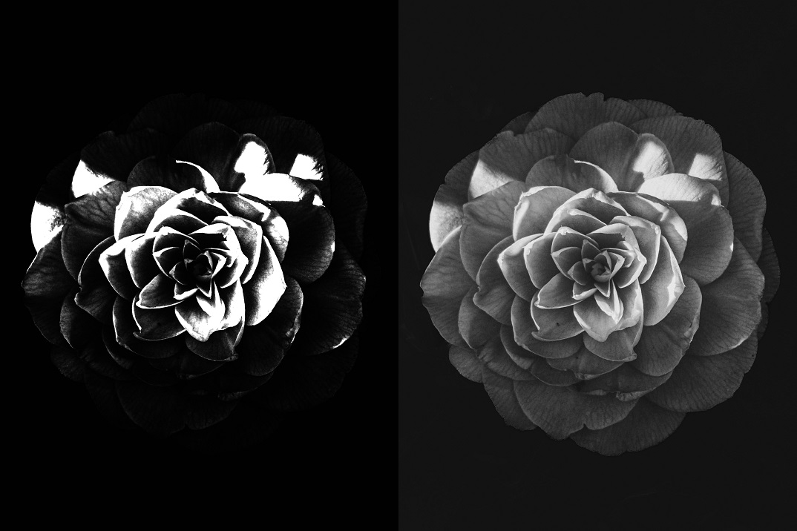

# Gauss sketch book
Gauss sketch book contains generalized implementation of Difference of Gaussians or DoG in short.

Featured Filters:
- DoG
- XDoG
- FDoG (⚠ WIP)

## Features
- `presentation.mlx` matlab live script where the implementation of the methods are explained step by step.
- 🦀Rust library of mentioned filters. used for static image filtering and realtime filtering.
- 🐍Python binding of the rust.

## Installs
- [MATLAB](https://www.mathworks.com/products/matlab.html) for `presentation.mlx`.
- [Rust](https://www.rust-lang.org) for using the rust library.
- [Python](https://www.python.org) for using the python library.

## Examples
Raw image on the right and Filtered image on the left.
### XDoG
`σ = 1.4 | ε = 0.6 | p = 1.0 | φ = 6.0`

## How to Use
### `presentation.mlx`
Open the file in MATLAB and run the script.

**Note:** the script depends on the `assets/images` and `assets/textures` folder.

### `Rust`
⚠ work in progress

### `Python`
⚠ work in progress

## References
- [This is the Difference of Gaussians](https://www.youtube.com/watch?v=5EuYKEvugLU) by Acerola. Special thanks to him ✨
- [XDoG: An eXtended difference-of-Gaussians compendium including advanced image stylization](references/eXtended_difference_of_gaussians.pdf)
- [Image Abstraction by Structure Adaptive Filtering](references/image_abstraction_by_structure_adaptive_filtering.pdf)
- [Flow-Based Image Abstraction](references/flow_based_image_abstraction.pdf)
- [Color Image Quantization For Frame Buffer Display](references/color_quantization.pdf)